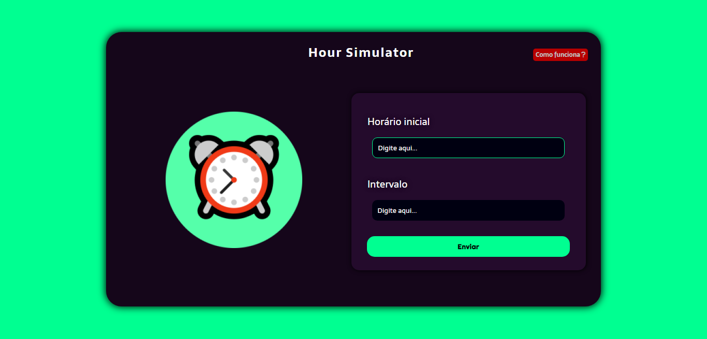
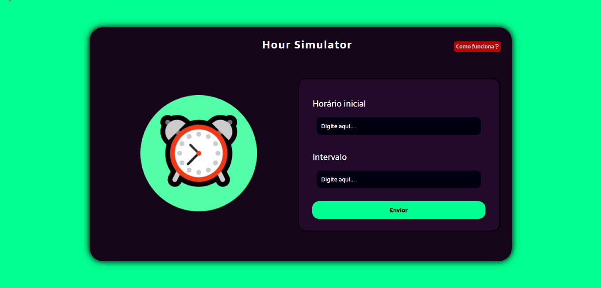
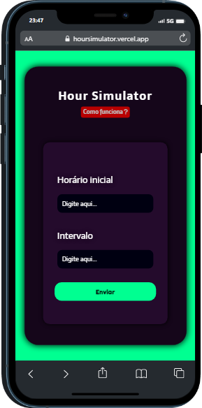
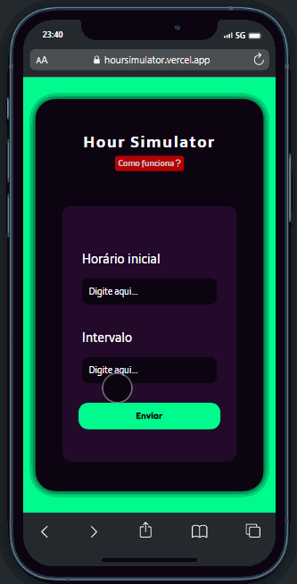

# 💊​ Simulador de horários de remédio

Esse é o meu quarto projeto, criado para demonstrar meus conhecimentos de lógica de programação manuseando a linguagem JavaScript, mas também para ser acrescentado ao meu site de projetos desenvolvidos. 👩‍💻🧠 

### 📌  Você pode acessar o projeto clicando <a href= "https://hoursimulator.vercel.app/"> AQUI </a>  
<!-- #### - ou dar uma olhadinha nos gifs do projeto, ao final do readme. <3 -->

## ⁉ Como funciona o site?
#### O Hour Simulator tem o intuito de indicar os horários para tomar remédio, que são exibidos conforme o horário inicial e intervalo de horas fornecidos pelo usuário. Serão exibidos quantas vezes tomar o remédio ao dia e seus respectivos horários. 
#### ▶ Exemplo: intervalo: 3h, horário incial: 03h. 1° Horário: 03h, 2° Horário: 09h, 3° Horário: 12h...

 ## ​👩‍💻​ Desenvolvimento

Para desenvolver o projeto, foram utilizadas apenas as tecnologias HTML, CSS e JavaScript. Foram aplicados conhecimentos de responsividade, usufruindo do recurso Media Query. 
Esse é o primeiro projeto onde aplico alguma lógica para obter resultados usando JavaScript.

Dentro do portifólio na seção "Projetos" se encontra o meu primeiro projeto, você pode obter o código fonte <a href="https://github.com/devanarodrigues/DC"> aqui. </a>

## 💢 Demonstração
#### - Pagina inicial
 
 

#### - Responsividade (Iphone 12 PRO)

 

##### Você pode conferir meus outros projetos clicando <a href= "https://anaprojetos.vercel.app/"> AQUI</a>.
#### ⚡ estou aberta a opiniões construtivas, dicas e ideias.
## - Obrigada por ler até aqui! 💗
